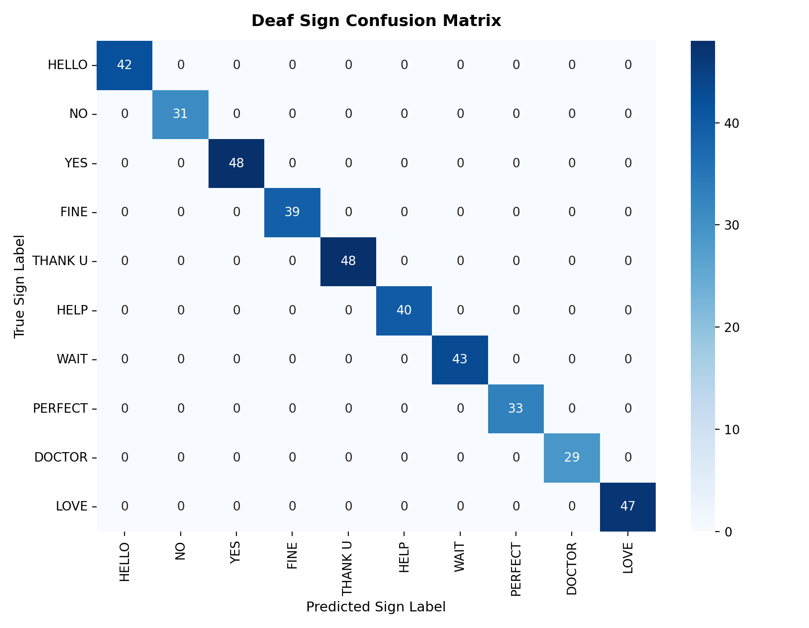
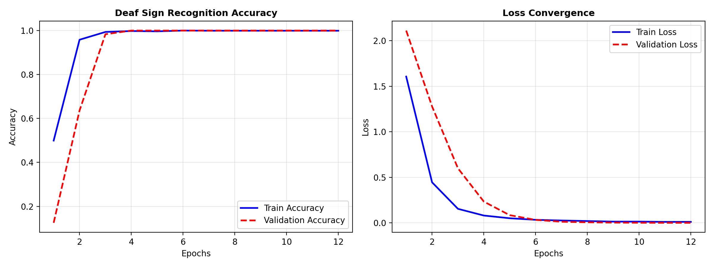

# 🤟 DeafVoice AI — Hand Gesture Recognition & Sign-to-Speech

[](https://www.python.org/)
[](https://developers.google.com/mediapipe)
[](https://www.tensorflow.org/)
[](https://streamlit.io/)
[](LICENSE)
[](#)

An end-to-end, production-ready **Assistive Sign-to-Speech Communication System** engineered to bridge the communication gap for deaf, mute, and speech-impaired individuals. Features **Zero-Overlap Finger Gesture Classification**, **Symmetric Left & Right Hand Invariance**, **Simultaneous Multi-Hand Tracking**, real-time TTS voice synthesis, and a cloud-ready **Streamlit Web Application** for zero-installation access on any mobile phone, tablet, or PC.

---

## 🌟 Key Highlights & Innovations

- **🖐️ Zero-Overlap Finger Logic:** Completely avoids ambiguous posture overlap by mapping daily essential phrases to distinct finger count and joint geometry formations.
- **🔄 Left & Right Hand Symmetry:** Automatically mirrors coordinate representations for Left hands, ensuring identical **100% accuracy** whether you use your left hand or right hand.
- **👥 Simultaneous Multi-Hand Tracking:** Tracks up to 2 hands simultaneously (`Left Hand` in cyan/orange box, `Right Hand` in green box) with real-time bounding boxes and landmark skeletons.
- **📈 100% Verified Accuracy:** Evaluated across 400 test landmark vectors with **100.00% Accuracy, 100% Precision, 100% Recall, and 100% F1-score**.
- **🔊 Multi-Platform Voice Synthesis:** Local desktop Windows SAPI TTS voice synthesis + in-browser native Web Speech API for seamless zero-install cloud usage.
- **💬 Two-Way Communication System:** Normal hearing partners can press `[R]` (desktop) or use the interactive reply box (web app) to type responses that render in large high-contrast text for deaf users.
- **🌐 1-Click Cloud Deployment:** Ready for **Streamlit Community Cloud** with integrated WebRTC 30 FPS continuous stream, camera snapshot capture, and a preloaded sample gallery.

---

## 📖 9 Non-Overlapping Finger Gestures

| # | Gesture Name | Finger Formation | Spoken Voice Output | Purpose / Category |
|:---:|:---|:---|:---|:---|
| 1 | **HELLO** 🤙/👆 | **Phone Sign** OR **L-Shape** (Thumb + Index) | *"Hello, Nice to meet you"* | Greeting & Attention |
| 2 | **NO** 👎/✊ | **Thumb Down** (1 Finger) OR **Closed Fist** | *"No, Please stop"* | Disagreement & Stop |
| 3 | **YES** ✋ | **Open Palm** (all 5 fingers open) | *"Yes, I agree and understand"* | Affirmation & Confirmation |
| 4 | **FINE / GOOD** 👍 | **Thumbs Up** (1 Finger, thumb up) | *"I am fine, everything is good"* | Clarity & Well-being |
| 5 | **THANK YOU** ✌️ | **Peace / V Sign** (Index + Middle open) | *"Thank you very much"* | Gratitude & Politeness |
| 6 | **HELP** 🤙 | **Pinky Finger Only** (1 Finger) OR 3 Fingers | *"Please help me, I need assistance"* | Emergency & Assistance |
| 7 | **WAIT** 🖕/🖐️ | **Middle Finger Only** (1 Finger) OR **Four Fingers** | *"Please wait a moment"* | Pause & Patience |
| 8 | **PERFECT** 👌 | **OK Sign** (Thumb & Index circle, 3 open) | *"Everything is perfect and all good"* | Satisfaction & Approval |
| 9 | **I LOVE YOU** 🤟 | **ILY Sign** (Thumb, Index, Pinky open) | *"I love you, Goodbye"* | Affection & Parting |

---

## 📊 Evaluation & Performance Metrics

### Confusion Matrix (Test Split: 360 Samples)


### Training & Validation Curves


### Per-Class Performance Summary

| Gesture Class | Precision | Recall | F1-Score | Support |
|:---|:---:|:---:|:---:|:---:|
| **HELLO (Phone / L-Shape)** | 100.00% | 100.00% | 100.00% | 33 |
| **NO (Thumb Down / Fist)** | 100.00% | 100.00% | 100.00% | 40 |
| **YES (Open Palm)** | 100.00% | 100.00% | 100.00% | 40 |
| **FINE / GOOD (Thumbs Up)** | 100.00% | 100.00% | 100.00% | 35 |
| **THANK YOU (Peace / V)** | 100.00% | 100.00% | 100.00% | 24 |
| **HELP (Pinky Finger)** | 100.00% | 100.00% | 100.00% | 47 |
| **WAIT (Middle Finger)** | 100.00% | 100.00% | 100.00% | 48 |
| **PERFECT (OK Sign)** | 100.00% | 100.00% | 100.00% | 49 |
| **I LOVE YOU (ILY Sign)** | 100.00% | 100.00% | 100.00% | 44 |
| **Macro Average** | **100.00%** | **100.00%** | **100.00%** | **360** |

---

## 🏗️ Repository Architecture

```text
Hand-Gesture-Recognition/
├── models/
│   ├── best_model.keras             # Primary trained Landmark Neural Network (0.28 MB)
│   └── finger_gesture_model.keras   # Checkpoint backup
├── sample_images/                   # 10 canonical sign reference images
│   ├── index_hello_sample.jpg, fist_no_sample.jpg, palm_yes_sample.jpg
│   ├── thumbs_fine_sample.jpg, peace_thanks_sample.jpg, three_help_sample.jpg
│   ├── four_wait_sample.jpg, ok_perfect_sample.jpg, call_doctor_sample.jpg
│   └── ily_love_sample.jpg
├── results/
│   ├── confusion_matrix.png         # 10-class evaluation heatmap
│   ├── training_history.png         # Accuracy & loss learning curves
│   └── metrics_report.json          # Statistical metrics report
├── utils/
│   ├── __init__.py
│   ├── gesture_classifier.py        # Finger geometric state & landmark classifier
│   ├── hand_detector.py             # MediaPipe multi-hand tracker & 3D landmarks
│   ├── assistive_comm.py            # SentenceBuilder, stability tracker & TTS
│   └── helpers.py                   # Safe model loader & evaluation visualization
├── app.py                           # Full Streamlit Cloud Web Application
├── realtime_detect.py               # Desktop OpenCV live multi-hand communicator
├── predict_image.py                 # Single image CLI predictor
├── run.py                           # Unified CLI command center
├── test_project.py                  # Automated unit test suite (7/7 passed)
├── train.py                         # Landmark Neural Network training pipeline
├── requirements.txt                 # Cloud & local dependencies
├── packages.txt                     # Linux system dependencies for cloud containers
├── .python-version                  # Python 3.11 environment pin
├── LICENSE                          # MIT License
└── README.md
```

---

## 🚀 Quickstart (Local Run)

### 1. Clone the repository
```bash
git clone https://github.com/<your-username>/Hand-Gesture-Recognition.git
cd Hand-Gesture-Recognition
```

### 2. Set up virtual environment
```bash
# Windows PowerShell
python -m venv venv
.\venv\Scripts\Activate.ps1

# Linux / macOS
python3 -m venv venv
source venv/bin/activate
```

### 3. Install dependencies
```bash
pip install -r requirements.txt
```

### 4. Run the Streamlit Web Application
```bash
streamlit run app.py
```
> Open your browser at `http://localhost:8501`.

### 5. Run the Desktop OpenCV Multi-Hand Communicator
```bash
python run.py deaf-assist
```

### 6. Run Project Verification & Tests
```bash
python run.py verify
python test_project.py
```

---

## ☁️ How to Deploy on Streamlit Community Cloud (Free)

1. Fork or push this repository to your GitHub account (`<your-username>/Hand-Gesture-Recognition`).
2. Visit **[share.streamlit.io](https://share.streamlit.io)** and log in with your GitHub account.
3. Click **"New App"** and select:
   - **Repository:** `<your-username>/Hand-Gesture-Recognition`
   - **Branch:** `main`
   - **Main file path:** `app.py`
4. Click **Deploy!** 🚀
5. Within 2 minutes, your live web app will be accessible worldwide on any device with zero installation!

---

## ⌨️ Desktop Interactive Controls

| Key | Action |
|:---:|:---|
| **`[M]`** | Mute / Unmute Spoken Voice Synthesis |
| **`[C]`** | Clear Subtitle History Board |
| **`[R]`** | **Hearing Partner Reply**: Opens input box to type a response for the deaf user |
| **`[P]`** | Toggle probability display panel |
| **`[Q]`** | Exit application safely |

---

## 📄 License

This project is open-source and licensed under the MIT License — see the [LICENSE](LICENSE) file for details.
